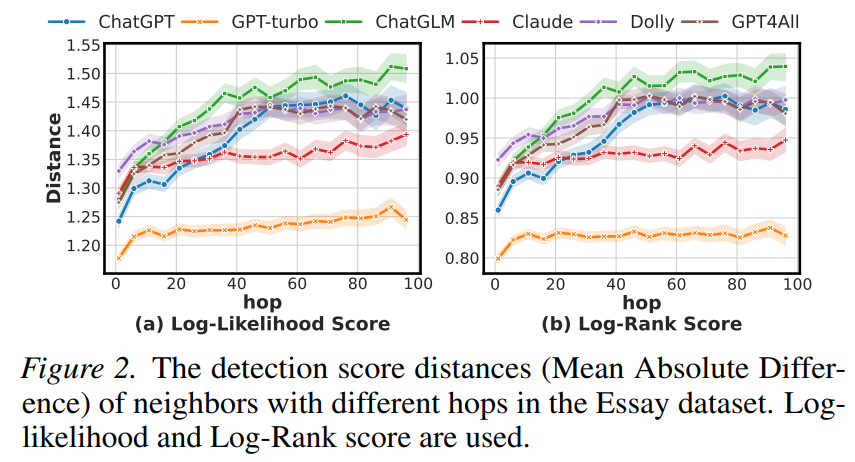
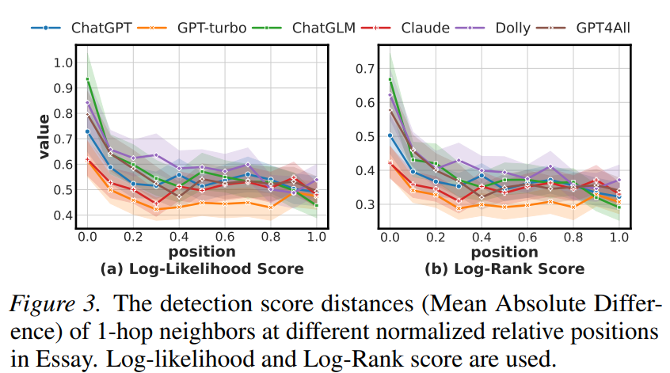

# Beyond Raw Detection Scores: Markov-Aware Calibration for Boosting Machine-Generated Text Detection

This is the source code for the paper "[Beyond Raw Detection Scores: Markov-Aware Calibration for Boosting Machine-Generated Text Detection](https://openreview.net/forum?id=Lzwkeg2o2z&referrer=%5BAuthor+Console%5D%28%2Fgroup%3Fid%3DICLR.cc%2F2026%2FConference%2FAuthors%23your-submissions%29)".




## Introduction

While machine-generated texts (MGTs) offer great convenience, they also pose risks such as disinformation and phishing, highlighting the need for reliable detection. Metric-based methods, which extract statistically distinguishable features of MGTs, are often more practical than complex model-based methods that are prone to overfitting. 

Given their diverse designs, we first place representative metric-based methods within a unified framework, enabling a clear assessment of their advantages and limitations. Our analysis identifies a core challenge across these methods: the token-level detection score is easily biased by the inherent randomness of the MGTs generation process.
To address this, we theoretically and empirically reveal two relationships of context detection scores that may aid calibration: Neighbor Similarity and Initial Instability. We then propose a Markov-informed score calibration strategy that models these relationships using Markov random fields, and implements it as a lightweight component via a mean-field approximation, allowing our method to be seamlessly integrated into existing detectors. 

Extensive experiments in various real-world scenarios, such as cross-LLM and paraphrasing attacks, demonstrate significant gains over baselines with negligible computational overhead.

## Installation
Configure the Python runtime environment and download the pre-trained detection model.
```
conda env create -f environment.yml;
conda activate Detection;
download gpt2-medium model from https://huggingface.co/openai-community/gpt2-medium, and move it to save_models/;
download gpt2-medium model from https://huggingface.co/openai-community/gpt2-xl, and move it to save_models/;
download gpt2-medium model from https://huggingface.co/openai-community/gpt2, and move it to save_models/;
download t5-base model from https://huggingface.co/google-t5/t5-base, and move it to save_models/;
```

## Raw Token-level Detection Score Calculation
The raw detection scores calculated by various detection methods are obtained and saved to the `./datasets/embedding/` folder.
```
usage: python benchmark.py --finetune [--method METHOD] [--dataset DATA_NAME] [--detectLLM TEST_TEXT] [--iter ITER]

optional arguments:
  --method METHOD
                        Supported: Log_Likelihood, Log_Rank, Entropy, DetectGPT, FastGPT, DNAGPT
  --dataset DATA_NAME
                        Supported: Essay, Reuters, DetectRL, Mix (mixed text scenario), polish and dipper (paraphrasing attack scenario)
  --detectLLM TEST_TEXT
                        Supported: 
                          Essay & Reuters: ChatGPT-turbo, ChatGLM, Dolly, ChatGPT, GPT4All, Claude;
                          DetectRL: ChatGPT, CGoogle-PaLM, Llama-2-70b;
                          Mix: ChatGPT, Google-PaLM, Llama-2-70b;
                          polish: ChatGPT, Google-PaLM, Llama-2-70b;
                          dipper: ChatGPT, Google-PaLM, Llama-2-70b;
  --iter ITER
                        random seed

Example: python benchmark.py --finetune --dataset Essay --detectLLM GPT4All --method Log_Likelihood --DEVICE cuda:0 --iter 0
```

Alternatively, you can run the following command to obtain the raw detection scores of all detection methods across all datasets.
```
usage: python run_all.py
```

## Detection Score Calibration and Evaluation
Run and evaluate the proposed MRF-based correction method. 

Note: When running a specific detector on a particular dataset, it is essential to ensure that the detector calculates all raw detection scores on that dataset as described above. For example, when running Log_Likelihood on the Essay dataset, it is crucial to ensure that raw Log_Likelihood detection scores are generated for all data from ChatGPT-turbo, ChatGLM, Dolly, ChatGPT, GPT4All, and Claude within the Essay dataset.

* Usage of Log_Likelihood, Log-Rank, Entropy: 
```
python improve_mrf.py [--method METHOD] [--dataset DATA_NAME]

optional arguments:
  --method METHOD
                        Supported: Log_Likelihood, Log-Rank, Entropy
  --dataset DATA_NAME
                        Supported: Essay, Reuters, DetectRL, Mix (mixed text scenario), polish and dipper (paraphrasing attack scenario)
                        
Example: python improve_mrf.py --method Log_Likelihood --dataset Essay
```
* Usage of DetectGPT: 
```
python improve_mrf_detectgpt.py [--dataset DATA_NAME]

optional arguments:
  --dataset DATA_NAME
                        Supported: Essay, Reuters, DetectRL, Mix (mixed text scenario), polish and dipper (paraphrasing attack scenario)
                        
Example: python improve_mrf_detectgpt.py --dataset Essay
```
* Usage of FastGPT: 
```
python improve_mrf_fastgpt.py [--dataset DATA_NAME]

optional arguments:
  --dataset DATA_NAME
                        Supported: Essay, Reuters, DetectRL, Mix (mixed text scenario), polish and dipper (paraphrasing attack scenario)
                        
Example: python improve_mrf_fastgpt.py --dataset Essay
```
* Usage of DNAGPT: 
```
python improve_mrf_dnagpt.py [--dataset DATA_NAME]

optional arguments:
  --dataset DATA_NAME
                        Supported: Essay, Reuters, DetectRL, Mix (mixed text scenario), polish and dipper (paraphrasing attack scenario)
                        
Example: python improve_mrf_dnagpt.py --dataset Essay
```

## Citing Our Work
If you are interested in our work, please cite our work:
```
@inproceedings{wu2026beyond,
title={Beyond Raw Detection Scores: Markov-Aware Calibration for Boosting Machine-Generated Text Detection}, 
author={Chenwang Wu, Yiu-ming Cheung, Shuhai Zhang, Bo Han, and Defu Lian},
booktitle = {International Conference on Learning Representations},
year = {2026}
}
```